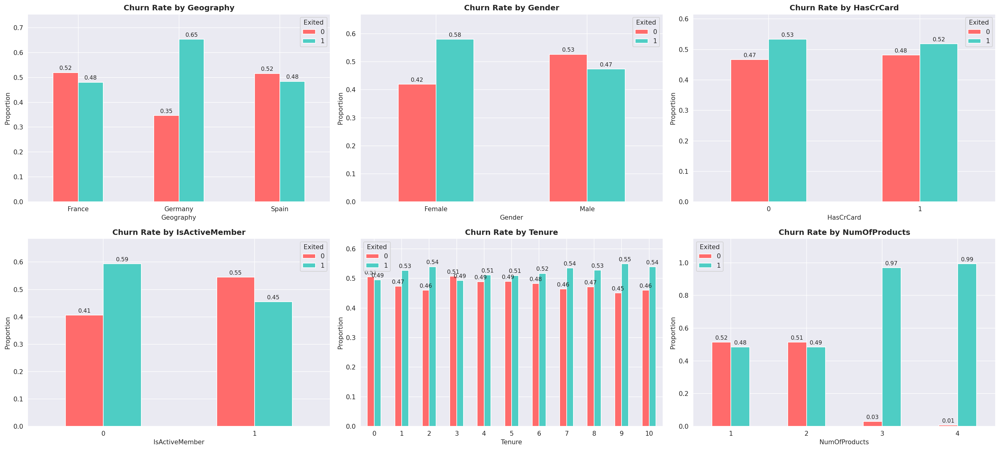
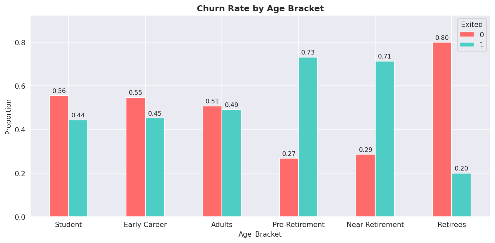
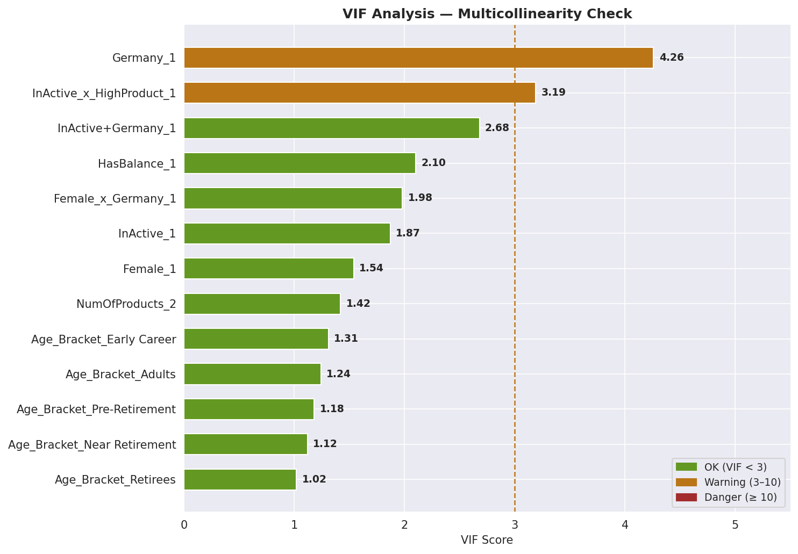

# 🏦 Bank Customer Churn Prediction

Binary classification model to predict which bank customers are likely to churn, using interaction features and domain-driven feature engineering. Built as a Kaggle Playground Series competition submission.

---

## 📌 Problem Statement

Customer churn is costly — acquiring a new customer is far more expensive than retaining an existing one. This project builds an interpretable churn predictor that identifies high-risk customers early, enabling targeted retention campaigns before they leave.

---

## 📂 Dataset

**Source:** [Kaggle Playground Series S4E1](https://www.kaggle.com/competitions/playground-series-s4e1)

| Split | File |
|---|---|
| Train | `train.csv` |
| Test | `test.csv` |
| Submission | `sample_submission.csv` |

**Target variable:** `Exited` (1 = churned, 0 = retained)  
**Train/Validation split:** 80/20 stratified by target.

---

## 🔍 EDA Highlights

Key churn rates observed during exploratory analysis:



| Feature | High-Risk Group | Churn Rate |
|---|---|---|
| `IsActiveMember` | Inactive | 30% vs 13% (Active) |
| `NumOfProducts` | 3–4 products | 87–88% |
| `Geography` | Germany | 38% vs ~17% (France/Spain) |
| `Gender` | Female | 28% vs 16% (Male) |
| `Age` | Pre-Retirement (55–65) | 57% |
| `Balance` | Non-zero balance | 27% vs 16% (zero) |

**Features dropped** after EDA (no meaningful signal):
- `Tenure` — flat churn rate across all groups (19–26%)
- `EstimatedSalary` — nearly identical churn across salary brackets (21–23%)
- `HasCrCard` — minimal difference (21% vs 23%)

---

## 🔧 Feature Engineering

### Interaction Features
Non-linear risk combinations that Logistic Regression cannot capture without explicit encoding:

| Feature | Churn Rate | vs Baseline |
|---|---|---|
| `InActive_x_HighProduct` (Inactive + 3+ products) | **92%** | 4.6× |
| `InActive+Germany` (Inactive + Germany) | **50%** | 2.7× |
| `Female_x_Germany` (Female + Germany) | **46%** | 2.6× |

### Bracket Features
Continuous variables binned to capture non-linear relationships:



| Feature | Bins | Rationale |
|---|---|---|
| `Age_Bracket` | Student / Early Career / Adults / Pre-Retirement / Near Retirement / Retirees | Churn peaks at 55–65, low at young ages |
| `HasBalance` | Binary (Balance > 0) | Non-zero balance is the meaningful split; amount beyond that adds little signal |

### Dropped Raw Features (after bracket creation)
`CreditScore`, `Balance`, `EstimatedSalary`, `Tenure`, `HasCrCard`, `Geography`, `Gender`, `IsActiveMember`

---

## ⚙️ Preprocessing Pipeline

```
Raw Data
   ↓ Drop ID columns (id, CustomerId, Surname)
   ↓ EDA-driven feature selection
   ↓ Interaction feature creation
   ↓ Age / Balance bracketing
   ↓ OneHotEncoder (drop='first' to avoid dummy trap)
   ↓ VIF Analysis
   ↓ Logistic Regression
```

---

## 🔬 Multicollinearity Check (VIF)



| Feature | VIF | Status |
|---|---|---|
| `Germany_1` | 4.26 | ⚠️ Warning — retained after AUC comparison |
| `InActive_x_HighProduct_1` | 3.19 | ⚠️ Warning — retained (high predictive value) |
| All others | 1.02–2.68 | ✅ OK |

Two model versions (with/without `Germany_1`) were compared on validation ROC-AUC. `Germany_1` provided marginal improvement and was retained.

---

## 🤖 Model

**Logistic Regression** with `class_weight='balanced'` and `max_iter=500`

Logistic Regression was selected for:
- **Interpretability** — coefficients directly explain feature contributions, useful for stakeholder communication and regulatory requirements
- **Strong baseline** — ROC-AUC ~0.87 on validation set demonstrates that high-quality feature engineering can make a linear model highly competitive

---

## 📊 Results

| Metric | Value |
|---|---|
| ROC-AUC (Validation) | ~0.87 |
| Primary Metric | ROC-AUC (competition requirement) |

---

## 🚀 How to Run

1. Join the Kaggle competition and download the dataset files
2. Open the notebook in Kaggle or Jupyter
3. Run all cells in order — EDA → feature engineering → VIF → training → submission

```python
# Key dependencies
pip install -r requirements.txt
```

---

## 🔮 Future Improvements

- **Gradient Boosting (XGBoost / LightGBM)** — automatically capture non-linear interactions without manual feature creation, potentially improving AUC further
- **SHAP Analysis** — explain individual predictions ("this customer is high-risk because: Inactive + Germany + 3 products") for actionable retention decisions
- **Behavioral Trend Features** — if time-series data is available, add 3–6 month trends in balance, login frequency, and transaction activity as early churn signals
- **Cost-Sensitive Threshold Optimization** — define a business cost matrix (cost of missed churn vs cost of unnecessary retention offer) and optimize the decision threshold accordingly
- **Concept Drift Monitoring** — churn patterns may shift over time due to market conditions or customer behavior changes, making it important to monitor model performance in production
